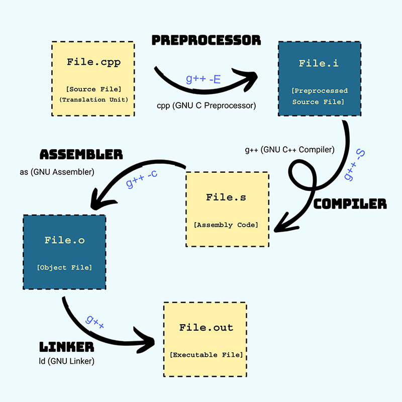

احتمالاً تا الان یک آشنایی اولیه با Makefile دارید. در این مطلب
می خواهیم یک مرور کلی از پروسه کامپایل کردن و پروژه های چند
فایلی با استفاده از Makefile داشته باشیم و به چند نکته مهم در آن
اشاره کنیم. در نهایت هم ابزار CMake را به طور مختصر معرفی
می کنیم.
Makefile یک ابزار برای تولید فایل قابل اجرا برنامه از سورس آن
است. این ابزار برای dependency management استفاده می شود.
برای درک بهتر این مطلب، خوب است که مروری بر نحوه کامپایل
شدن یک برنامه سی یا سی++ داشته باشیم.

<!--truncate-->

:::tip
می تونید نسخه pdf مجله رو از [اینجا](./Compilation%20Steps,%20Make%20&%20CMake.pdf) دانلود کنید !
:::


# مراحل کامپایل, Make & CMake


## مراحل کامپایل


### 1. Preprocessor

خروجی این فاز، همان کد ورودی است که روی آن چند پیش پردازش انجام شده است.

از جمله پیش پردازش ها، expand کردن
ماکروها، دیفاین ها و اینکلودها و حذف
کامنت هاست.

برای مثال، اگر یک file.hpp داشته باشیم و آن
را در file.cpp اینکلود کنیم، می بینیم که در
file.i کل محتوای file.hpp به جای دستور
include# آمده است.

فلگ E-، خروجی این فاز را می دهد:

```
g++ -E file.cpp -o file.i
```

### 2. Compiler

خروجی این فاز، فایلی اسمبلی است
که کد تبدیل شده به دستورات CPU
مربوطه است.

فلگ S-، خروجی این فاز را می دهد:

```
g++ -S file.cpp -o file.s
```

### 3. Assembler

خروجی این فاز، فایلی باینری است
 که کد اسمبلی تبدیل شده به
دستورات ماشین باینری است.

فلگ c-، خروجی این فاز را می دهد:

```
g++ -c file.cpp -o file.o
```


### 4. Linker

خروجی این فاز، برنامه قابل اجرا است.
در این فاز، چندین object file یعنی فایل o. با
هم ترکیب می شوند و یک فایل خروجی تولید
می شود. (لایبرری ها [فایل a.] هم در همین فاز
به کد وصل می شوند)
یعنی اگر چند فایل file1.cpp و file2.cpp داشته
باشیم، هر کدام از اینها به طور مستقل به فایل
o. تبدیل شده و در نهایت به هم وصل می شوند:

```
g++ file1.o file2.o -o file.out
```

### مثال :




وقتی می زنیم: ```g++ file.cpp -o file.out```، همه این مراحل به صورت یکجا طی می شوند!
وقتی با پروژه ای چند فایلی کار داریم، به جای اینکه با هر تغییر، کل این مراحل برای همه فایل ها طی شوند (که باعث افزایش
چشم گیر زمان کامپایل می شود)، هر کدام از فایل های سورس (که به آنها translation unit هم گفته می شود) را در ابتدا تبدیل به
object file می کنیم (فایل o.)، و در نهایت آنها را لینک می کنیم.

حال وقتی که یک فایل تغییر می کند، نیازی به کامپایل مجدد همه فایل ها نیست. فقط فایلی که تغییر کرده دوباره به o. کامپایل
می شود و با هم از نو لینک می کنیم.


## Makefile

### وابستگی ها (Dependencies)

ما می خواهیم فایل ها فقط در صورت تغییر مجدد کامپایل
شوند. برای انجام این کار بحث dependencies قابل اجتناب
نیست. وقتی یک فایل تغییر می کند، بدیهیست که به کامپایل
مجدد نیاز دارد. ولی در حالتی دیگر، که وقتی فایلی که اینکلود
شده هم تغییر می کند، باید از اول کامپایل کنیم چرا که
تغییرات فایل هدر می تواند روی فایل ما تاثیر داشته باشد.
در Makefile، برای هر فایل سورس (translation unit) همه
dependencyهای آن را می نویسیم. برنامه Make با توجه به
تاریخ تغییر فایل ها، اگر یک فایلی نیازمند کامپایل مجدد بود،
آن را انجام می دهد.

برای استفاده، فایل متنی به نام Makefile یا makefile را در
تاپ لول پروژه مان می سازیم و دستور make را در ترمینالی که
در محل پروژه باز است اجرا می کنیم.

کامنت کردن در Makefile با استفاده از کاراکتر # انجام
می شود.

### قانون (Rule)

یک قانون میک فایل از 3 بخش تشکیل شده است:

```
target: prerequisites
 recipe
```


target  فایلیست که می خواهیم تولید کنیم، prerequisites
وابستگی ها (dependency) می باشند و recipe دستوریست که در
صورت جدیدتر بودن یکی از prerequisiteها از target اجرا
می شود. توجه کنید که recipe باید با کاراکتر تب و نه اسپیس
شروع شود. در غیر این صورت با ارور missing separator 
مواجه می شویم.

در عمل چنین قوانینی را داریم:

```
file.o: file.cpp file.hpp file2.hpp
 g++ -c file.cpp -o file.o
```


هر object file به یک cpp و چندین hpp وابسته است.
اینجا هدف (target) ساخت file.o است که به 3 فایل
جلویش وابسته است. در صورت جدیدتر بودن یکی از آنها از
file.o، دستور زیرش اجرا می شود که فایل را کامپایل می کند.

### متغیرهای اتوماتیک (Automatic Variables)

برای جلوگیری از تایپ تکراری، Makefile چندین automatic
variable دارد که نوشتن قوانین را راحت می کنند. چند تا از
آنها را با استفاده از یک مثال نام می بریم:

```
file.o: file.cpp file.hpp file2.hpp
```

```
$@ = file.o
 (the target)
$^ = file.cpp file.hpp file2.hpp
 (all prerequisites)
$< = file.cpp
 (the first prerequisite)
$? = e.g. file.cpp file2.hpp
 (prerequisites newer than target)
```

با استفاده از آنها، قوانین تولید object file ها به شکل زیر
نوشته می شوند:

```
file.o: file.cpp file.hpp file2.hpp
 g++ -c $< -o $@
```

### متغیرها (Variables)

در Makefile برای افزایش خوانایی کد، می توان متغیرها را به
شکل زیر تعریف کرد:

```
FILES = file.o file2.o
```

در صورت طولانی بودن تعریف متغیر (یا هر خطی از جمله
prerequisiteها)، می توان با استفاده از کاراکتر \ ادامه تعریف را
به خط بعدی برد:

```
FILES = src/file1.cpp \
        src/file2.cpp
```

برای دسترسی به مقدار این متغیر، از variable expansion 
استفاده می کنیم:

```
$(FILES) or ${FILES}
```

برای متغیرها، علاوه بر =، می توان از چند اپراتور دیگر هم
استفاده کرد که شامل =: و =+ و =? است.

فرق = و =: در وقتی است که در تعریف متغیر یک expansion
داشته باشیم. وقتی متغیر با = مقدار دهی شده باشد، هر بار که
به مقدارش دست می یابیم متغیرهای داخلش را از نو expand
می کند ولی =: فقط یکبار و در همان خط، expansionها را انجام
می دهد. 

با یک مثال نکته بالا را نشان می دهیم:

```
foo = abc
bar = $(foo) bar
foo = xyz
# $(bar) is now "xyz bar"
```

در صورتی که در تعریف bar از =: استفاده می کردیم، با تغییر
مقدار foo مقدار آن تغییر نمی کرد.

با استفاده از =+ می توان به انتهای مقدار یک متغیر اضافه کرد.

اپراتور =? وقتی متغیر مقداری نداشته باشد، به آن مقدار سمت
راست را می دهد.

### توابع (Functions)

توابع در makefile داخل ()$ نوشته می شوند که اولین کلمه آن
نام تابع است و در ادامه پارامترهای آن می آید.

مثلا از تابع info برای پرینت کردن استفاده می شود:

```
$(info Printing a variable: $(var))
```

با تابع wildcard می توان فایل ها را با * انتخاب کرد:

```
$(wildcard *.txt)
```

با استفاده از تابع shell می توان خروجی یک دستور ترمینال را
گرفت. مثلا تابع زیر همه فایل های cpp. داخل فولدر src را
می دهد:

```
FILES = $(shell find src/ -name "*.cpp" -type f)
```

توابع firstword و lastword کلمه اول و آخر یک رشته (یا مقدار
متغیر) را می دهند.

تابع filter برای نگه داشتن کلماتی که با pattern خاصی مچ
می شوند استفاده می شود. تابع filter-out برعکس این کار را
انجام می دهد و آنهایی که مچ هستند را حذف می کند.

مثال زیر main.cpp و همه فایل هایی که با o. تمام می شوند را
از VAR حذف می کند:

```
VAR2 = $(filter-out main.cpp %.o, $(VAR))
```

تابع patsubst که مخفف pattern substitution است، به شکل
زیر است:

```
$(patsubst %.o,%.cpp,file.o file2.s file3.o)
```

خروجی این تابع file.cpp و file3.cpp است.

یک ساختار میک فایل که مشابه patsubst کار می کند
 substitution reference است :

```
$(var:pattern=replacement)
```

معادل مثال بالا:

```
$(var:%.o=%.cpp)
```

### دستور (Recipe)

بخش recipe یک قانون می تواند از چند دستور در چند خط
نیز تشکیل شده باشد. دستورها در یک subshell اجرا
می شوند و خود دستور اجرا شده نیز در ترمینال پرینت
می شود.

برای جلوگیری از پرینت خود دستور می توان قبل از آن کاراکتر
@ را گذاشت:

```
print-help:
 echo This prints echo and the text
 @echo This doesn’t print the echo command
```

برای جلوگیری از پرینت شدن خروجی دستور می توان آن را به
null device ری دایرکت کرد:

```
command arg >/dev/null
 # redirect stdout to null
command arg >/dev/null 2>&1
 # redirect errors to stdout as well
```

در صورتی که target هیچ prerequisite-ای نداشته باشد،
می توان خط اول recipe را به شکل زیر نوشت:

```
target: ; recipe
```

وقتی که در حین اجرای یک recipe دستوری ارور دهد، اجرای
make تمام می شود. می توان با گذاشتن - قبل از دستور
ارورها را ایگنور کرد:

```
-g++ file.cpp
```


### هدف (Target)

اگر در command-line جلوی دستور make نام target-ای را
بیاوریم، آن یک قانون را به طور خاص اجرا می کند. در صورت
اجرای make خالی، اولین قانون در فایل اجرا می شود.

قوانینی که کاری با فایلی به نام target ندارند را در تارگتی به
نام PHONY. قرار می دهیم. مانند قانون print-help که بالاتر
نوشته شد و یا تارگت مرسوم all که در آن همه خروجی های
برنامه را تولید می کنیم:

```
.PHONY: all print-help
all: $(EXE)
```

همانطور که می بینیم، یک قانون می تواند recipe-ای نداشته
باشد و فقط چند تارگت را صدا بزند:

```
.PHONY: clean clean-obj clean-exe
clean: clean-obj clean-exe
```

با استفاده از PHONY. مطمئن می شویم که اگر فایلی هم نام
target بود مشکلی ایجاد نمی شود.

### مثال کامل

از آنجا که قانون ساخت EXE کار linker را انجام می دهد، برای
ورودی تمامی o.ها به آن داده شده است (^$).

``` 
FILES = file.o file2.o
EXE = program.out
CXX = g++ -std=c++11
all: $(EXE)
$(EXE): $(FILES)
 $(CXX) $^ -o $@
file.o: file.cpp file.hpp file2.hpp
 $(CXX) -c $< -o $@
file2.o: file2.cpp file2.hpp
 $(CXX) -c $< -o $@
.PHONY: all clean
clean:
 rm -f $(FILES) $(EXE)
```

## CMake,یک جایگزین ؟

### Build System

بیلد سیستم ها برنامه هایی اند که برای تولید خودکار خروجی
قابل اجرای کد ما استفاده می شوند.

Makefile یک بیلد سیستم محسوب می شود و پس از
توصیف پروژه مان به آن، می تواند به صورت خودکار پروژه را
کامپایل کند و وابستگی ها را در نظر می گیرد.

هر زبان برنامه نویسی بیلد سیستم های خودش را دارد. برای
مثال در زبان جاوا Maven و Gradle مشهورند.

### اکوسیستم سی++

سی++ تنها یک استاندارد است و کامپایلرها، پیاده سازی ای از
آن استاندارد هستند. از آنجا که در استاندارد گفته نشده،
ابزار استانداردی برای مدیریت بیلد و لایبرری و... وجود ندارد.

از این رو ابزارهای متعددی در این راستا توسط جامعه
توسعه دهندگان سی++ ساخته شده است.

چند مورد از این ابزارها، Makefile، Bazel و هر IDE از جمله
Visual Studio  که روش خودشان را برای هندل کردن
پروژه ها دارند. یا مثلا Ninja که با هدف سریع بودن بیلدها
ساخته شده است.

ولی برخی ابزار، خودشان هدف بیلد کردن را ندارند. بلکه
چیزی high-level تر هستند که با نوشتن یک توصیف پروژه،
می توانند آن را به توصیف مورد نیاز برای بیلد سیستم های
مختلف تبدیل کنند.

از جمله این برنامه ها Premake و CMake است.

### مشکل محیط توسعه

همانطور که معلوم است، System Build ها الزاما cross-platform نیستند. 

در یک پروژه که افراد زیادی روی آن کار می کنند، معمولا
نمی شود همه را محدود به یک سری ابزار خاص برای کد
زدنشان کرد. مثلا یکی روی VS کار می کند (که از file solution
و vcxproj استفاده می کند) و یکی در لینوکس کد می زند و از
Makefile استفاده می کند.

با استفاده از ابزاری مثل CMake، می توان برای اکثر Build
Systemها و IDEها فایل توصیف پروژه را تولید کرد و فقط
یک توصیف اصلی در فرمت خود CMake (که در فایل
CMakeLists.txt نوشته می شود) داشت.

### CMake

همانطور که گفته شد، CMake یک برنامه برای تولید فایل
پروژه های مختلف از یک شرح پروژه مشترک است. یعنی
CMake خود کار بیلد شدن را مستقیم انجام نمی دهد بلکه
به بیلد سیستم های دیگر می سپارد.

CMake از زبان توصیفی خود استفاده می کند و پس از
نوشتن CMakeLists.txt، با اجرای برنامه می توانیم فایل های
بیلد سیستم مورد نظرمان را دریافت کنیم.

این ابزار dependencyها را هم به طور خودکار هندل
می کند. این یعنی نیازی به نوشتن دستی تمامی
prerequisiteهای object file ها نیست.

### یک مثال ساده

فرض کنید سه فایل زیر را در پروژه داریم:

```
├── foo.cpp
├── foo.hpp
└── main.cpp
```

داخل foo.cpp یک تابع تعریف شده که declaration آن در
foo.hpp قرار دارد. در نهایت این تابع توسط main صدا زده
می شود. در ادامه برای بیلد کردن این پروژه کوچک، از CMake
استفاده می کنیم.

### قدم اول

در اولین مرحله ابتدا باید ورژنی از CMake را که از آن استفاده
می کنیم مشخص کنیم؛ این موضوع باعث می شود توابع
CMake-ای که استفاده می کنیم توسط ورژن مناسبی از
CMake که آن ها را پشتیبانی می کند اجرا شوند. برای این کار از
تابع زیر استفاده می کنیم:

```
cmake_minimum_required(VERSION <min>)
```
بلافاصله بعد از تعیین ورژن CMake باید نام پروژه را تعیین
کنیم. این کار از طریق تابع زیر قابل انجام است:

```
project(<PROJECT-NAME>
 [VERSION <major>[.<minor>[.<patch>]]]
 [DESCRIPTION <project-description-string>]
 [HOMEPAGE_URL <url-string>]
 [LANGUAGES <language-name>...])
```

بنابراین در انتها برای پروژه خودمان دو خط زیر را به فایل
CMakeLists.txt اضافه می کنیم:

```
cmake_minimum_required(VERSION 3.12)
project(foo_proj
 VERSION 1.0
 DESCRIPTION “A project to introduce CMake”
 LANGUAGES CXX)
```

### قدم دوم

پس از تعیین ورژن CMake و نام پروژه، باید فایل مد نظر
خروجی به همراه فایل کدهای آن را تعیین کنیم. فایل خروجی
می تواند مثلا فایلی قابل اجرا یا یک لایبرری باشد. به
خروجی ها target می گویند.

```
add_executable(<name>)
```

متغیر ```<name>``` باید در یک پروژه یکتا باشد. حال می توان برای
target ساخته شده فایل های کد را تعیین کرد:

```
target_sources(<name> PRIVATE
 <source1> <source2>...)
```

علاوه بر آن واضح است که تنها یک تابع main باید در
فایل های لیست شده وجود داشته باشد.

```
add_executable(foo)
target_sources(foo PRIVATE
 main.cpp foo.cpp)
```

اکنون می شود برای target ساخته شده برخی مشخصات از
جمله نسخه سی++ را تعیین کرد:

```
target_compile_features(foo PRIVATE cxx_std_11)
```

### قدم آخر

اکنون برای بیلد کردن پروژه، ابتدا یک فولدر build می سازیم و
داخل آن دستور زیر را وارد می کنیم:

```
cmake ..
```

با این کار، فایل های build system پلتفرم فعلی در فولدر
کنونی (build) با استفاده از CMakeLists.txt فولدر قبلی (..)
ساخته می شود.

پس از ساخته شدن بیلد سیستم مورد نظر (مثلا یک
Makefile)، با دستور مورد نظر آن سیستم، فایل قابل اجرا را
می سازیم (مثلا دستور make را می زنیم).
اکنون پروژه بیلد شده و آماده اجرا می باشد.
