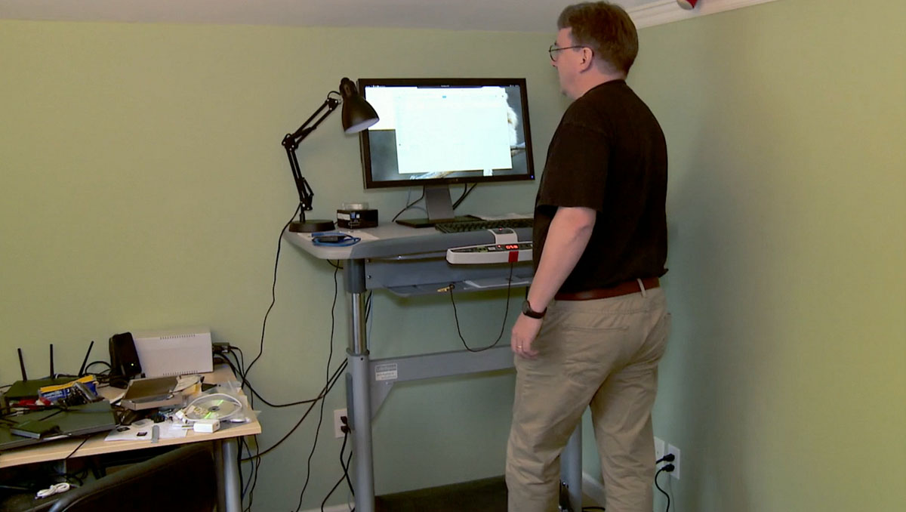
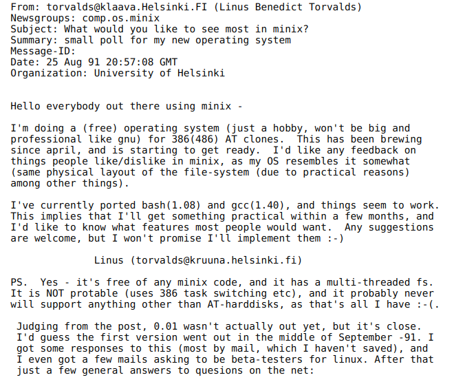

# آشنایی با لینوکس

## لینوکس چیست؟

همانند ویندوز، iOS و macOS، لینوکس نیز یک سیستم‌عامل است. اندروید، که یکی از محبوب‌ترین سیستم‌عامل‌های تلفن همراه است، نسخه‌ای ویرایش‌شده از لینوکس محسوب می‌شود. اما برخلاف بسیاری از سیستم‌عامل‌های دیگر، لینوکس یک سیستم‌عامل متن‌باز است. این به این معناست که استفاده، تغییر و توزیع آن به‌صورت رایگان امکان‌پذیر است.

## سیستم‌عامل چیست؟

سیستم‌عامل نرم‌افزاری است که منابع سخت‌افزاری دستگاه شما را مدیریت می‌کند و در واقع ارتباط میان سخت‌افزار و سایر نرم‌افزارها را فراهم می‌آورد. بدون وجود سیستم‌عامل، مدیریت ارتباط بین نرم‌افزارها و سخت‌افزار بسیار پیچیده و دشوار می‌شد، زیرا هر نرم‌افزار به‌صورت مستقیم با سخت‌افزار ارتباط برقرار می‌کرد و واحدی یکتا برای مدیریت این ارتباطات وجود نداشت.

## تاریخچه

### تاریخچه GNU

پروژه **GNU** (که مخفف "GNU's Not Unix" است) در سال ۱۹۸۳ توسط **ریچارد استالمن** (Richard Stallman) آغاز شد. هدف اصلی این پروژه ایجاد یک سیستم‌عامل آزاد و متن‌باز بود که به کاربران اجازه دهد بدون محدودیت‌های نرم‌افزارهای اختصاصی، از نرم‌افزارها استفاده، آنها را مطالعه، تغییر و توزیع کنند. استالمن برای این منظور، بنیاد نرم‌افزار آزاد (Free Software Foundation - FSF) را تأسیس کرد و به تدریج اجزای مختلفی از یک سیستم‌عامل مانند کامپایلر GCC، ویرایشگر متن Emacs و هسته‌هایی مانند Hurd را توسعه داد.

  

  
  

### تاریخچه Linux

**لینوکس** در سال ۱۹۹۱ توسط **لینوس توروالدز** (Linus Torvalds) به عنوان یک پروژه شخصی آغاز شد. توروالدز که در آن زمان دانشجوی دانشگاه هلسینکی بود، یک هسته (kernel) جدید برای سیستم‌عامل شبیه به Unix نوشت و آن را تحت مجوز GNU GPL منتشر کرد. او این پروژه را "Linux" نامید.

  

  
  

  

  
  

### ترکیب GNU و Linux

هسته لینوکس به تنهایی یک سیستم‌عامل کامل نیست و نیاز به ابزارها و کتابخانه‌های مختلفی دارد که توسط پروژه GNU توسعه داده شده‌اند. ترکیب این هسته با اجزای GNU، سیستم‌عامل کامل و قابل استفاده‌ای را ایجاد کرد که ما امروز آن را به نام **GNU/Linux** می‌شناسیم. این سیستم‌عامل به یکی از محبوب‌ترین و گسترده‌ترین سیستم‌های‌عامل در جهان تبدیل شده است.

### اهمیت تاریخی

GNU/Linux به عنوان یک سیستم‌عامل آزاد و متن‌باز، تحولی در دنیای نرم‌افزار ایجاد کرد و به پایه‌ای برای توسعه نرم‌افزارهای آزاد و پروژه‌های بزرگ دیگری مانند توزیع‌های مختلف لینوکس (مانند Ubuntu، Debian، Red Hat) و همچنین سیستم‌عامل‌های موبایلی مانند Android تبدیل شد.

## نصب و راه‌اندازی

دو روش رایج برای نصب لینوکس عبارتند از استفاده از ماشین مجازی (VM) و راه‌اندازی سیستم Dual Boot. هر روش دارای مزایا و ملاحظات خاص خود است و برای سناریوها و نیازهای مختلف کاربران مناسب است.

هر دو روش ماشین مجازی و Dual Boot با مزایا و چالش‌های منحصر به فرد خود همراه هستند. ماشین‌های مجازی برای کاربرانی که به انعطاف‌پذیری، ایمنی و توانایی اجرای همزمان چند سیستم عامل نیاز دارند، بهترین گزینه هستند، هرچند با هزینه عملکرد پایین‌تر. از طرف دیگر، Dual Boot انتخاب مناسبی برای کسانی است که به حداکثر عملکرد و دسترسی کامل به سخت‌افزار نیاز دارند، اگرچه به برنامه‌ریزی و تنظیمات دقیقی نیاز دارد.

ماشین مجازی (VM) به شما امکان می‌دهد لینوکس را در یک محیط ایزوله و امن، همزمان با سیستم‌عامل اصلی خود اجرا کنید، اما با کاهش عملکرد و مصرف بیشتر منابع. در مقابل، Dual Boot به شما اجازه می‌دهد لینوکس را به‌طور بومی با عملکرد بالا و دسترسی کامل به سخت‌افزار اجرا کنید، اما نیاز به پارتیشن‌بندی دقیق و بوت مجدد برای تغییر سیستم‌عامل دارد.

انتخاب روش مناسب بستگی به نیازهای خاص شما، توانایی‌های سیستم و راحتی شما با مدیریت پارتیشن‌ها و سیستم‌عامل‌ها دارد. برای آزمایش‌های معمول یا توسعه، یک VM ممکن است کافی باشد. اما اگر قصد دارید لینوکس را برای وظایف با عملکرد بحرانی استفاده کنید، Dual Boot گزینه مناسب‌تری خواهد بود.

در ادامه روش‌های نصب و راه‌اندازی لینوکس را توضیح می‌دهیم.
