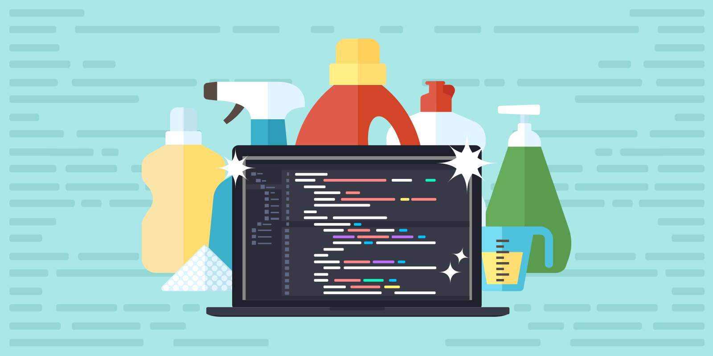

# مقدمه

هدف کد نوشتن فقط حل کردن یک مسئله نیست. چرا که با بزرگتر شدن مسئله، حجم کد ها افزایش پیدا می­‌کند و باعث می­‌شود کد ها تبدیل به یک کلاف درهم پیچیده شود. قضیه جایی پیچیده­‌تر می­‌شود که بخواهیم کد قدیمی را گسترش بدهیم یا در یک گروه و به همراه برنامه نویسان دیگر کد بنویسیم.
برای جلوگیری از این مسائل می­‌توانیم از ابتدا کد با کیفیت بنویسیم که یکی از ملاک‌­های مهم کد با کیفیت، تمیزی کد است.
هر شخصی می­‌تواند کدی بنویسد که کامپیوتر آن را متوجه بشود، اما برنامه نویس خوب کدی می­‌نویسد که علاوه بر کامپیوتر، انسان­‌ها هم متوجه بشوند.
در ادامه روش­‌های تمیز کد نوشتن را یاد می­‌گیریم و سعی می­‌کنیم در تمام کد هایی که می­‌نویسیم این قواعد را رعایت کنیم.

## کد تمیز چیست؟

به کدی قابل خواندن، قابل نگهداری و قابل توسعه باشد کد تمیز می‌گوییم. در اینجا به برخی از مهم‌ترین اصول و روش‌های کد تمیز اشاره می‌کنیم و در بخش های بعدی به طور مفصل به هر کدام می پردازیم:

    1. خوانایی (Readability):
خوانایی کد به معنای توانایی دیگر برنامه‌نویسان (و حتی خودمان در آینده) در فهمیدن و دنبال کردن منطق و جریان کد است. کدی که خوانا باشد، به راحتی قابل درک، پیگیری و نگهداری است.
    2. سادگی (Simplicity):
سادگی کد به معنای طراحی و نگارش کدی است که دارای کمترین میزان پیچیدگی بوده و به راحتی قابل فهم، نگهداری و گسترش باشد. ساده بودن کد به معنای حذف جزئیات غیرضروری و تمرکز بر حل مسئله به شکلی واضح و مختصر است.

    3. توابع کوتاه (Short Functions)
    4. یکپارچگی (Consistency):
یکپارچگی کد به معنای ثبات و هماهنگی در سبک و روش کدنویسی در سراسر یک پروژه نرم‌افزاری است. این مفهوم تضمین می‌کند که تمامی قسمت‌های کد به شکلی همگن و هماهنگ نوشته شوند، به طوری که خواندن، درک و نگهداری آن‌ها آسان‌تر شود.
    5. آزمون‌پذیری (Testability):
آزمون‌پذیری کد به معنای سهولت و امکان‌پذیری انجام تست‌ها و آزمون‌های مختلف بر روی کد برای اطمینان از صحت و عملکرد درست آن است. کدی که آزمون‌پذیر باشد، به راحتی می‌توان آن را تست کرد تا اطمینان حاصل شود که بدون اشکال کار می‌کند و به راحتی می‌توان مشکلات را پیدا و رفع کرد.

با رعایت این اصول و روش‌ها، می‌توانید کدی بنویسید که نه تنها به راحتی قابل فهم و نگهداری باشد، بلکه کیفیت و بهره‌وری کلی پروژه‌های نرم‌افزاری شما را نیز افزایش دهد.

> **Bjarne Stroustrup, inventor of C++ and author of The C++ Programming Language**: *I like my code to be elegant and efficient. The logic should be straightforward to make it hard for bugs to hide, the dependencies minimal to ease maintenance, error handling complete according to an articulated strategy, and performance
close to optimal so as not to tempt people to make the code messy with unprincipled optimizations. Clean code does one thing well.*

> **Grady Booch, author of Object Oriented Analysis and Design with Applications**: *Clean code is simple and direct. Clean code reads like well-written prose. Clean code never obscures the designer’s intent but rather is full of crisp abstractions and straightforward lines of control.*

