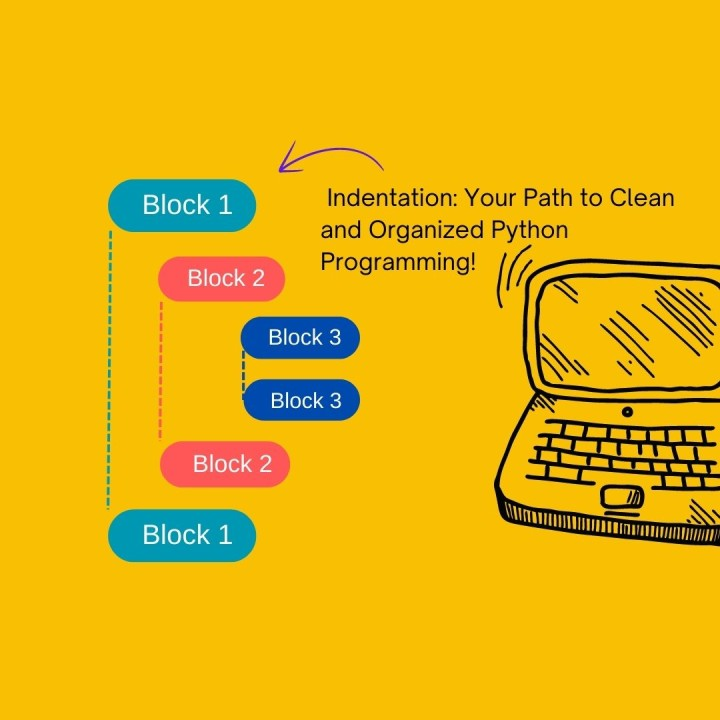
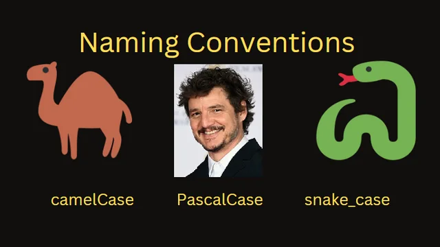

# خوانایی


## تورفتگی (indentation)



به معنای استفاده از فضاهای خالی یا تب‌ها برای تنظیم و فرمت‌بندی کد به گونه‌ای است که ساختار آن به وضوح قابل مشاهده باشد. این تکنیک به ما کمک می‌کند تا سلسله‌مراتب، بلوک‌های کد و ساختارهای کنترلی را به راحتی مشاهده و درک کنیم.

با رعایت اصول صحیح فاصله‌گذاری، کد شما هم از نظر خوانایی و هم از نظر نگهداری بهبود می‌یابد و همکاری در تیم‌های بزرگ‌تر را ساده‌تر می‌کند.

برای مثال:

- تورفتگی خوب:

```cpp
#include <iostream>
using namespace std;

int main() {
    int number = 10;

    if (number > 0) {
        cout << "Number is positive." << endl;
    } else {
        cout << "Number is non-positive." << endl;
    }

    return 0;
}
```

- تورفتگی بد:

```cpp
#include <iostream>
using namespace std;
int main() {
int number = 10;
if (number > 0) {
cout << "Number is positive." << endl;
} else {
cout << "Number is non-positive." << endl;
}
return 0;
}
```

## نام نیکو گر بماند ز آدمی به کزو ماند سرای زرنگار


اسم هایی که انتخاب می کنیم در همه جای برنامه دیده می شوند. از اجزای درون کد مثل متغیر ها، توابع، کلاس ها گرفته تا خود فایل کد 😊. بنابراین با توجه به گسترده بودن اسم گذاری، بهتر است خیلی به آن توجه کنیم و به بهترین شکل آن را انجام بدهیم.
اسمی که برای هر چیزی انتخاب می کنیم باید در نگاه اول به این سوالات پاسخ دهد:

- چرا وجود دارد
- چه کاری انجام می‌دهد

پس اگر اسمی انتخاب کردیم که برای پاسخ به این سوالات نیاز به کامنت یا توضیح داشته باشد، اسم مناسبی نیست.

برای مثال:

```cpp
int d; // elapsed time in day
```

اسم d هیچ حسی درباره کاربرد این متغیر ایجاد نمی کند. برای مثال این اسم برای متغیر مناسب تر است:

```cpp
int elapsedTimeInDay;
```

نکاتی که خوب است در نام‌گذاری رعایت کنیم:
    1. نام‌هایی انتخاب کنیم که تلفظ آن راحت باشد
مثلا genymdhms هم تلفظ سختی دارد هم خوب معنا را منتقل نمی‌کند. این کلمه نشان دهنده generation date,year, month, day, hour, minute,and second است
    1. نام‌هایی انتخاب کنیم که بتوان در کد آن را جستجو کرد
جستجو کردن اعداد یا نام های تک حرفی در کد بسیار سخت است و تغییر دادن آن ها دشوار است. مثلا به جای عدد 3 که نشان دهنده تعداد کلاس است می‌توان یک متغیر به نام NUMBER_OF_CLASSES تعریف کرد.

### روش های نام گذاری



1. **PascalCase**:
برای اسم هایی که چند بخش دارند، حرف اول هر کلمه را بزرگ می نویسیم مثلا TotalValue

1. **snake_case**:
برای اسم هایی که چند بخش دارند، هر بخش را با علامت underscore (_)  جدا می کنیم مثلا matrix_transpose

1. **camelCase**:
برای اسم های چند بخشی حرف اول کلمه اول کوچک و حرف اول بقیه کلمات را بزرگ می نویسیم مثلا numberOfItems

**توجه کنید برای نام‌گذاری هر بخش خاص به سلیقه خود می‌توانید هر کدام از این روش‌ها را انتخاب کنید. اما هرگز دو روش را باهم ترکیب نکنید. مثلا برای نام‌گذاری متغیر ها، اگر از snake_case استفاده می کنید، تمام متغیر ها باید به همین شکل باشند.**

#### کاربرد های پیشنهادی

- *PascalCase*:
  - اسم تایپ‌ها (کلاس، استراکت و typedefها و …)

- *camelCase*:
  - اسم متغیرها
  - اسم متدها و توابع
  - فیلدهای Private (برای جداسازی از فیلدهای Public می توانید انتهای فیلد های Private علامت (_) استفاده کنید)

**نکته: اسم کانستنت‌ها کاملا با حرف بزرگ نوشته شود و کلمات توسط _ از همدیگر جدا شوند**

## کامنت


کامنت‌ها به خودی خود بد یا خوب نیستند بلکه خوب یا بد بودن آن‌ها را بر اساس نحوه استفاده تعریف می کنیم. به طور کلی بهتر است از کامنت استفاده نکنیم و هدف خود را به کمک کد بیان کنیم.
 اگر احساس کردید قسمتی از کد نیاز به کامنت دارد، ابتدا باید فکر کنید که آیا می‌توانید بدون کامنت و تغییر دادن کد منظورتان را برسانید یا خیر. مثلا با نام‌گذاری بهتر توابع یا متغیر ها تا حد خوبی می‌توان از کامنت نوشتن جلوگیری کرد.

مثال:

```cpp
// Check to see if the employee is eligible for full benefits
if ((employee.flags & HOURLY_FLAG) &&
(employee.age > 65))
```

در این قطعه کد دلیل استفاده از if در قالب کامنت توضیح داده شده. در حالی که می توان با تغییر کد از کامنت صرف نظر کرد:

```cpp
if (employee.isEligibleForFullBenefits())
```

با این کار هم از کامنت‌گذاری جلوگیری کردیم هم از کد تکراری. با تعریف این method در قسمت های دیگر کد نیازی به نوشتن if قسمت قبل نداریم و این موضوع کیفیت کد را بالا می برد.
