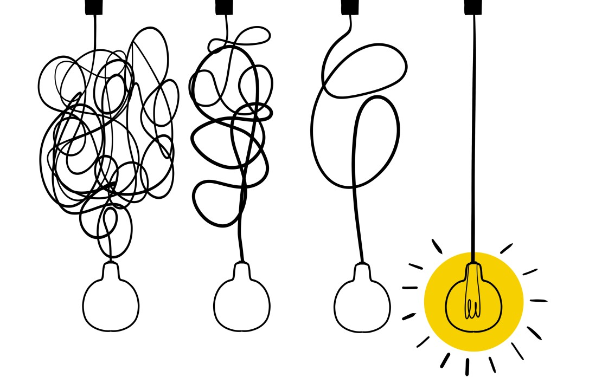

# سادگی



## طراحی ساده

اگر شما در یک جنگل پیچ در پیچ گیر افتاده باشید، ترجیح می‌دهید تا از تابلو های ساده‌ای که به طور شفاف مسیر را به شما نشان می‌دهند استفاده کنید تا نقشه‌ای که مجبور باشید جهت‌های جغرافیایی را تشخیص دهید تا مسیر خود را به بیرون پیدا کنید.
به طور کلی برای هر مسئله راه حل‌های گوناگونی وجود دارد که ممکن است به ذهن هر شخصی نرسد. ساده کد نوشتن به ما کمک می‌کند تا روند برنامه برای همه قابل درک باشد و این موضوع باعث می شود عیب یابی یا گسترش دادن کد برای ما آسان‌تر شود.
البته سادگی، به این معنی نیست که از هوش و خلاقیت در کدها صرف نظر کنیم. سادگی، یعنی به روشنی و شفافیت فکر کنیم و راه حل‌ها را به ساده‌ترین و قابل فهم‌ترین شکل ممکن بنویسیم.

## چگونه ساده کد بزنیم؟


برای این کار چهار قانون تعریف می کنیم:

1. کد همه تست‌ها را به درستی اجرا کند
1. قسمت‌های تکراری نداشته باشد
1. قصد و منظور برنامه‌نویس را نشان دهد
1. تعداد کلاس‌ها و method ها و توابع کم و معقول باشد

این قوانین توسط کنت بک (Kent Beck) **به ترتیب اولویت** مطرح شده‌اند.

### قانون اول


ایده‌ای که برای پیاده سازی یک برنامه داریم ممکن است خیلی شگفت انگیز باشد، اما در عمل خیر!
در واقع کدی که نتوان آن را تست کرد قابل استفاده نیست و نباید کدی بنویسیم که نتوانیم عملکرد آن را بررسی کنیم.

در قسمت‌های بعدی به طور مفصل درباره تست کردن برنامه صحبت می‌کنیم.

### قانون دوم


**دشمن** یک برنامه خوب، کد تکراری است. چون کد تکراری برنامه را پیچیده‌تر می کند. خط هایی در کد که کاملا شبیه به هم هستند یا قسمت‌هایی که عملیات یکسان انجام می‌دهند، تکراری محسوب می‌شوند و باید به گونه‌ای این مشکلات را رفع کنیم. معمولا با تعریف یک تابع یا اضافه کردن یک method به کلاس می توان قسمت‌های تکراری را حذف کرد.
مثلا در یک بازی برای حرکت بازیکن به جای اینکه برای هر جهت یک تابع بنویسیم:

```cpp
Position Player::WalkNorth() {
   Player player = GetPlayer();
   player.Move("N");
   return player.NewPosition;
}
 
Position Player::WalkSouth() {
   Player player = GetPlayer();
   player.Move("S");
   return player.NewPosition;
}
 
Position Player::WalkEast() {
   Player player = GetPlayer();
   player.Move("E");
   return player.NewPosition;
}
 
Position Player::WalkWest() {
   Player player = GetPlayer();
   player.Move("W");
   return player.NewPosition;
}
```

می توان یک تابع نوشت که به عنوان ورودی جهت بگیرد و حرکت را انجام دهد:

```cpp
Position Player::Walk(string direction) {
   Player player = GetPlayer();
   player.Move(direction);
   return player.NewPosition;
}
```

### قانون سوم


کد معرف ماست. برای اینکه راه حل خودمان را برای یک مسئله بیان کنیم باید کدی بنویسیم که این کار را انجام دهد و هر کسی با دیدن کد منظور و راه‌حل ما را متوجه شود. چون ما ضمیمه کد نیستیم که آن را توضیح بدهیم!

### قانون چهارم

اولویت این قانون از بقیه **کمتر** است. بنابراین سعی می کنیم در کد نوشتن بیشتر به موارد بالا بپردازیم. اما به طور کلی کوچک بودن کلاس‌ها و توابع و در کل برنامه از پیچیدگی آن کم می کند. فهمیدن کد طولانی طاقت فرساست و از آن بدتر پیدا کردن مشکل. در قسمت بعد به طور مفصل به توابع می پردازیم.
