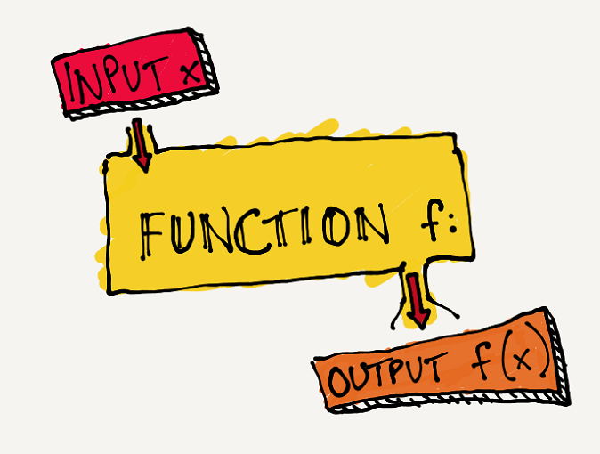

# توابع



در این قسمت ویژگی‌های تابع خوب را یاد می‌گیریم. به طور کلی تابعی خوب نوشته شده که خواندن و فهمیدن وظیفه آن به سادگی انجام شود.

## کوچک بودن

اولین ویژگی یک تابع خوب کوچک بودن آن است. اما چقدر کوچک؟ اگر برنامه را یک کتاب با چندین فصل در نظر بگیریم، هر تابع راوی یک فصل است. بنابراین باید تابع را به گونه‌ای بنویسیم که اول از همه اسم آن مشخص کند این بخش چه وظیفه‌ای دارد و خط های درون تابع روند را به وضوح نشان دهند. فصلی از کتاب که خیلی طولانی و مبهم باشد برای خواننده جذاب نیست و رشته داستان از دستش در می‌رود. همین مورد در نوشتن کد هم وجود دارد.

## یک وظیفه، یک تعهد!


هر تابع باید یک وظیفه داشته باشد که آن وظیفه را به بهترین شکل ممکن انجام دهد و **فقط** همان وظیفه را انجام دهد نه کار دیگر!
اما چگونه تشخیص دهیم؟ به تابع نگاه کنید. اگر توانستید یک تابع دیگر از دل آن استخراج کنید، تابع شما بیش از یک وظیفه دارد.

مثال: معمولا در خواندن ورودی، پردازش آن و خروجی دادن ممکن است به تک وظیفه بودن توابع توجه نکنیم. در این کد خواندن ورودی، پردازش ورودی و خروجی دادن در یک تابع انجام شده است. پس این تابع سه کار مختلف انجام می‌دهد.

```cpp
#include <iostream>
#include <string>

void processInput() {
    // Reading input
    std::string input;
    std::cout << "Enter your name: ";
    std::getline(std::cin, input);

    // Processing
    for (char &c : input) {
        c = toupper(c);
    }

    // Printing output
    std::cout << "Hello, " << input << "!" << std::endl;
}

int main() {
    processInput();
    return 0;
}
```

حالا این تابع را بازنویسی می‌‌کنیم. هر کار را به یک تابع ‌می‌سپاریم. یک تابع مسئول خواندن ورودی، یک تابع مسئول پردازش ورودی و تابعی دیگر مسئول خروجی دادن نتیجه است.

```cpp
#include <iostream>
#include <string>

std::string readInput() {
    std::string input;
    std::cout << "Enter your name: ";
    std::getline(std::cin, input);
    return input;
}

std::string processInput(const std::string& input) {
    std::string processedInput = input;
    for (char& c : processedInput) {
        c = toupper(c);
    }
    return processedInput;
}

void displayOutput(const std::string& output) {
    std::cout << "Hello, " << output << "!" << std::endl;
}

int main() {
    std::string input = readInput();
    std::string processedInput = processInput(input);
    displayOutput(processedInput);
    return 0;
}
```

## تعداد آرگومان‌های ورودی

بهتر است آرگومان‌های ورودی یک تابع کم باشند. تعداد آرگومان بین صفر تا سه منطقی است و در شرایط خاص می‌توان چهار یا پنج هم در نظر گرفت اما معمولا هر چه تعداد آرگومان‌ها بیشتر شود نشان‌دهنده این است که تابع شما تک وظیفه‌ای نیست و بتوان ساده‌تر هم آن را پیاده‌سازی کرد.
تست کردن تابع با تعداد آرگومان زیاد خیلی سخت است. تعداد حالت‌ها افزایش پیدا می‌کند و در هر تست باید تعداد زیادی آرگومان حاضر کنید.

## توابع خیانتکار: حواستان به پشت پرده باشد!


ممکن است تابع به ظاهر یک کار انجام دهد اما در باطن خیر! این حالت زمانی رخ می‌دهد که تابع ناخواسته یک سری اطلاعات را تغییر دهد. این مشکل به ویژه در حالتی رخ می‌دهد که آرگومان‌های تابع با آدرس یا رفرنس باشند. برای جلوگیری از تغییر، حتما آرگومان را به شکل const برای تابع تعریف کنید.

برای مثال یک تابع داریم که مقدار دو برابر عدد ورودی را بر می‌گرداند. چون عدد با رفرنس به تابع داده شده خود عدد هم در برنامه تغییر می‌کند.

```cpp
#include <iostream>

int calculateDouble(int& x) {
  x = x * 2;
  return x;
}

int main() {
  int x = 2;
  std::cout << "double: " << calculateDouble(x) << std::endl;
  std::cout << "x: " << x << std::endl;
  return 0;
}
```

خروجی

```text
double: 4
x: 4
```

برای حل این مشکل از const استفاده می‌کنیم:

```cpp
int calculateDouble(const int& x) {
  x = x * 2;
  return x;
}

int main() {
  int x = 2;
  std::cout << "double: " << calculateDouble(x) << std::endl;
  std::cout << "x: " << x << std::endl;
  return 0;
}
```

در اینجا اگر کد را کامپایل کنیم ارور می‌دهد. چون نمی‌توانیم متغیر را تغییر دهیم.

خروجی:

```text
prog.cpp: In function ‘int calculateDouble(const int&)’:
prog.cpp:6:4: error: assignment of read-only reference ‘x’
    6 |  x = x * 2;
      |  ~~^~~~~~~
```

بنابراین با نوشتن const اگر ناخواسته متغیری را تغییر دهید برنامه اصلا اجرا نمی‌شود و شما متوجه می‌شوید.

## برای یک کار چند نفر را استخدام نکنید!


در مسیر شکستن برنامه به توابع، ممکن است حالتی پیش بیاید که در ظاهر وظیفه دو تابع متفاوت است ولی در باطن یک کار انجام می دهند. فرض کنید برنامه یک رستوران را می‌نویسیم. این رستوران به مشتریان وفادار خود ۱۰ درصد تخفیف می‌دهد. بنابراین یک تابع برای این مورد می‌نویسیم که برای مشتریان وفادار ۱۰ درصد تخفیف اعمال کند و هزینه نهایی را اعلام کند.
همچنین برای جذب مشتری، برای کسانی که برای اولین بار خرید می‌کنند هم ۱۰ درصد تخفیف در نظر می‌گیریم. پس یک تابع برای اعمال این تخفیف برای مشتریان جدید می‌نویسیم.

```cpp
#include <iostream>

double calculateLoyaltyDiscount(double originalPrice) {
    return originalPrice * 0.9;
}

double calculateNewCustomerDiscount(double originalPrice) {
    return originalPrice * 0.9;
}

int main() {
    double price = 100.0;

    double loyaltyDiscountedPrice = calculateLoyaltyDiscount(price);
    double newCustomerDiscountedPrice = calculateNewCustomerDiscount(price);

    std::cout << "Price after loyalty discount: " << loyaltyDiscountedPrice << std::endl;
    std::cout << "Price for new customer discount: " << newCustomerDiscountedPrice << std::endl;

    return 0;
}
```

خروجی:

```text
Price after loyalty discount: 90
Price for new customer discount: 90
```

دو تابع calculateLoyaltyDiscount  وcalculateNewCustomerDiscount  وجود دارند که در ظاهر برای دو نوع مشتری مختلف استفاده می‌شوند، اما در واقع هر دو دقیقاً یک کار را انجام می‌دهند: اعمال تخفیف ۱۰٪ بر روی قیمت اصلی.
این یعنی یک کار را به دو تابع سپرده‌ایم. پس کد را اصلاح می‌کنیم و برای اعمال ۱۰ درصد تخفیف یک تابع در نظر می‌گیریم:

```cpp
#include <iostream>

double calculateDiscount(double originalPrice) {
    return originalPrice * 0.9;
}

int main() {
    double price = 100.0;

    double loyaltyDiscountedPrice = calculateDiscount(price);
    double newCustomerDiscountedPrice = calculateDiscount(price);

    std::cout << "Price after loyalty discount: " << loyaltyDiscountedPrice << std::endl;
    std::cout << "Price for new customer discount: " << newCustomerDiscountedPrice << std::endl;

    return 0;
}
```

خروجی:

```text
Price after loyalty discount: 90
Price for new customer discount: 90
```
