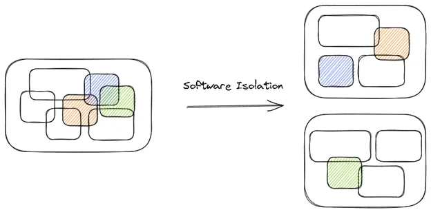
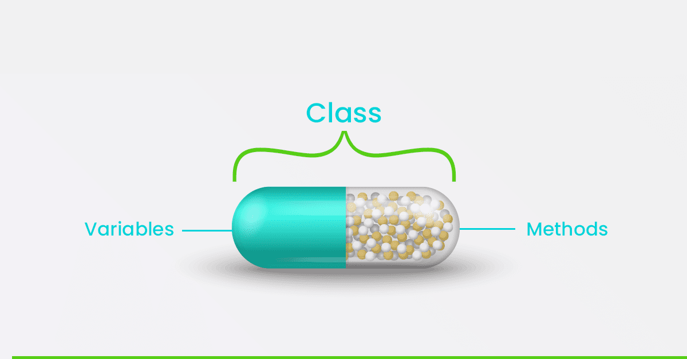
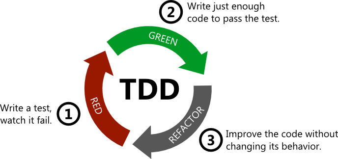

# آزمون‌پذیری

آزمون‌پذیری کد (Testability) یعنی کدی که نوشته‌ایم را بتوان به سادگی تست کرد و از عملکرد آن مطمئن شد. تمام مواردی که تا اینجا درباره آنها صحبت کردیم در آزمون‌پذیری کد نقش دارند و اگر آنها را رعایت کنیم، کدی داریم که تست کردن آن آسان است. برای مثال درباره سادگی کد بحث کردیم. ساده بودن کد هم احتمال خطا را کم می‌کند هم تست کردن آن راحت است.
در این قسمت ویژگی‌هایی را بررسی می‌کنیم که به ما در تست کردن کد کمک می‌کند.

## جداسازی (Isolation)

باید به گونه‌ای کد بنویسیم که بتوان اجزای آن را مستقل از هم تست کرد. هر چه وابستگی اجزای کد کمتر باشد تست کردن آنها راحت‌تر است. اگر اجزای کد بهم وابستگی شدیدی داشته باشند، در صورتی که یکی از اجزای کد باگ داشته باشد و بخواهیم آن را تغییر بدهیم، تمام قسمت‌هایی که قبلا تست کردیم باید دوباره تست شوند.

## کپسوله‌سازی (Encapsulation)

وقتی کد به خوبی کپسوله شده باشد، جزئیات داخلی یک کلاس از دید دیگر کلاس‌ها پنهان می‌ماند. این امر باعث می‌شود تغییرات در یک بخش، تأثیری بر دیگر بخش‌ها نداشته باشد و حوزه تست‌ها مشخص باشد. 

## TDD

توسعهٔ مبتنی بر آزمون (Test-Driven Development) یا (TDD)  یک روش برنامه‌نویسی است که در آن به جای اینکه اول دست به کد شویم، تست طراحی می‌کنیم و سپس کد را برای عبور از این تست‌ها می‌نویسیم. فرآیند  TDD به سه مرحلهٔ اصلی تقسیم می‌شود:

1. نوشتن تست
1. نوشتن کد
1. بازنگری

### قدم اول: نوشتن تست (Write a Test)

اولین قدم در TDD نوشتن یک تست است که برای یک قابلیت خاص یا بخش خاصی از کد نوشته می‌شود. تست باید ساده و سریع باشد و تنها یک حالت خاص را آزمایش کند.

### قدم دوم: نوشتن کد (Write Just Enough Code)

پس از نوشتن تست، به اندازه‌ای کد می‌نویسیم که تست درست اجرا شود. در این مرحله، کد باید تا حد امکان ساده و بدون پیچیدگی‌های اضافی باشد.

### قدم سوم: بازنگری و بهبود (Refactor)

وقتی تست عبور کرد، کد را بازنگری می‌کنیم تا ببینیم امکان بهتر کردن ساختار و خوانایی آن وجود دارد یا خیر. اگر تغییراتی لازم باشد، تغییرات را به گونه‌ای اعمال می‌کنیم که تست‌ها همچنان درست باشند.

این سه مرحله (نوشتن تست، نوشتن کد، بازنگری) به طور مداوم در TDD تکرار می‌شود. این چرخه به ما کمک می‌کند تا همواره از عملکرد صحیح کد اطمینان حاصل کنیم و به تدریج کد را با کیفیت‌تر کنیم.

### مزایای TDD

- **اطمینان از درستی کد**: چون ابتدا تست‌ها را طراحی می‌کنیم، مطمئن هستیم که کد عملکرد درستی دارد.
- **کاهش باگ‌ها**: با توجه به اینکه هر بخش از کد با تست همراه است، احتمال ایجاد باگ و مشکلات کاهش می‌یابد.
- **بهبود ساختار کد**:  چون هر قسمت را بازنگری می‌کنیم و تغییرات لازم را اعمال می‌کنیم.
