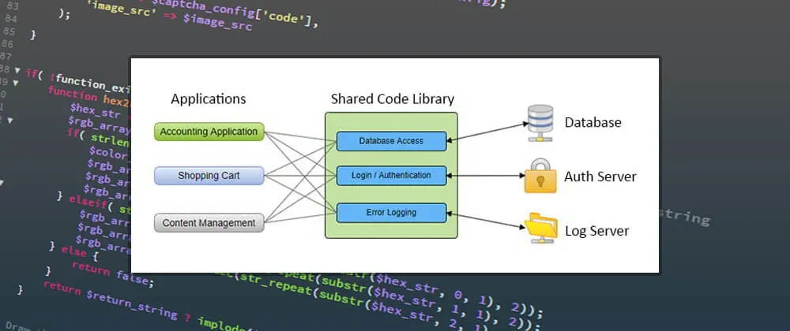

# کاربردهای  برنامه‌نویسی چندفایلی

## کاربردها

### 1. **سازماندهی بهتر کد**

با تقسیم کد به فایل‌های مجزا، توسعه‌دهندگان می‌توانند بخش‌های مختلف برنامه را به صورت منطقی سازماندهی کنند. این کار باعث می‌شود که یافتن و درک کد آسان‌تر شود.

### 2. **نگهداری آسان‌تر**

با تقسیم کد به فایل‌های کوچکتر، اعمال تغییرات و اشکال‌زدایی کد آسان‌تر می‌شود. این روش به توسعه‌دهندگان اجازه می‌دهد تا به راحتی بخش‌های مختلف برنامه را به‌روزرسانی کنند بدون اینکه تأثیری بر سایر بخش‌ها داشته باشد.

  

    
  

### 3. **همکاری موثرتر**

در پروژه‌های تیمی، برنامه‌نویسی چندفایلی به اعضای تیم اجازه می‌دهد تا به صورت همزمان روی بخش‌های مختلف برنامه کار کنند بدون اینکه تداخل ایجاد شود. این کار باعث افزایش بهره‌وری و کاهش زمان توسعه می‌شود.

### 4. **استفاده مجدد از کد**

فایل‌های مجزا می‌توانند به عنوان ماژول‌های مستقل استفاده شوند و در پروژه‌های دیگر نیز مورد استفاده قرار گیرند. این کار باعث افزایش کارایی و کاهش زمان توسعه می‌شود.

  

### 5. **کاهش زمان کامپایل**

با تقسیم کد به فایل‌های مجزا، کامپایلر می‌تواند تنها فایل‌هایی که تغییر کرده‌اند را کامپایل کند. این کار باعث کاهش زمان کامپایل و افزایش بهره‌وری می‌شود.

  

    
  

این روش به ویژه در پروژه‌های بزرگ و پیچیده که شامل هزاران خط کد هستند، بسیار مفید است. با استفاده از برنامه‌نویسی چندفایلی، توسعه‌دهندگان می‌توانند کد را به صورت ماژولار و قابل استفاده مجدد بنویسند و از مزایای سازماندهی بهتر و نگهداری آسان‌تر بهره‌مند شوند.
